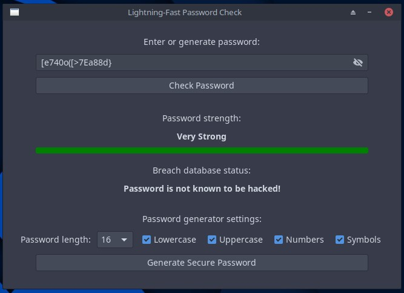
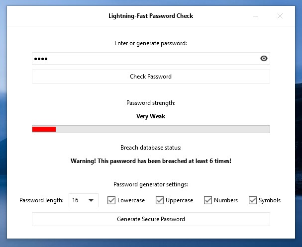

# Lightning-Fast Password Check

LFPCh is a small, cross-platform GUI application to check if your password is safe to use. The program conducts a two-step security check:
In step one, the password's quality is evaluated based on its length and character variety. In step two, the app checks whether
the password was part of an earlier data breach through the haveibeenpwned.com API. LFPCh provides an extra layer of security
compared to using the website directly, as the password data never actually leaves the computer. Implementing a k-Anonymity model,
only the first five characters of the password's sha1 hash is ever sent to the haveibeenpwned server, making its decoding impossible,
even if it is somehow intercepted. The application also includes a random password generator that creates a secure password, customizable
in accordance with the user's needs. The random generation is based on a "true" random seed provided by the x86 processor's DRNG unit.

LFCh was written entirely in C with speed and efficiency in mind. Its simple, GTK4 UI aims to provide a clean and easy-to-use interface.

## Screenshots

<p align="center">
  
  
</p>

## Installation

The building and installation process is done via the [Meson build system](https://mesonbuild.com/index.html), version 1.5.0 is required. Meson does include
a built-in pseudo-package manager called [WrapDB](https://mesonbuild.com/Wrapdb-projects.html) to download and compile dependencies, but this takes a very long time to complete. **We recommend these steps instead:**

### Dependencies

The application depends on the following shared libraries:

- glib-2.0
- gtk4
- libcrypto
- libcurl

The easiest way to procure these libraries is to install the packages containing them through a package manager.

On Linux (Debian-based), run the following commands in the terminal:

  ```bash
  sudo apt update
  sudo apt install -y libglib2.0-dev libgtk-4-dev libssl-dev libcurl4-openssl-dev
  ```

On Windows, you can use [MSYS2](https://www.msys2.org/) get the packages. This example is for the UCRT64 environment:

```bash
pacman -S mingw-w64-ucrt-x86_64-glib2 mingw-w64-ucrt-x86_64-gtk4 mingw-w64-ucrt-x86_64-openssl mingw-w64-ucrt-x86_64-curl
```

### Build and Install

LFPCh can be built and installed on both OS families with Meson. After downloading and unpacking the source directory, enter the following into the terminal:

```bash
cd /project/source/directory
meson setup builddir
meson install -C builddir
```

On Linux, the app installs to the conventional Unix filesystem locations ('/usr/bin' and '/usr/share'), and can be run with the "lfpch" command. On Windows, the target directory for all files is 'C:\Tools\lfpch'.

## Other

**Tested on:** Ubuntu 24.04, MX Linux 23.4, and Windows 11.

**Note:** The application's random generator depends on an x86 specific assembly instruction, therefore it will not work on different architectures.

App icon: [Password SVG Vector](https://www.svgrepo.com/svg/475163/password),  under [](http://creativecommons.org/publicdomain/zero/1.0/) license.

**[Contact](mailto:lcs_it@proton.me)**

[](https://www.gnu.org/licenses/gpl-3.0)
